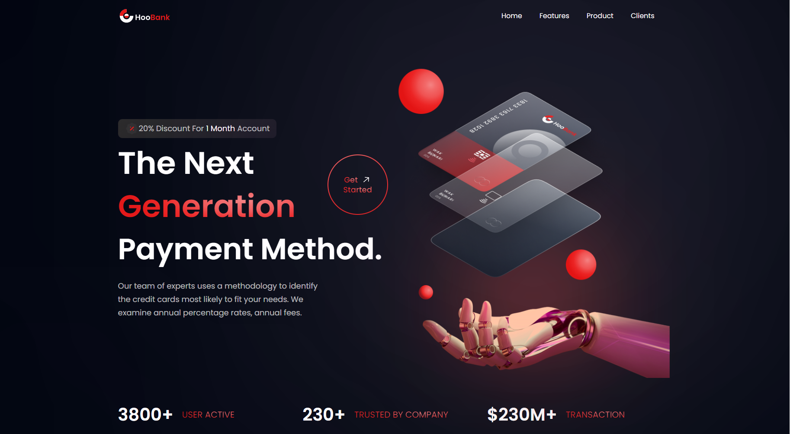
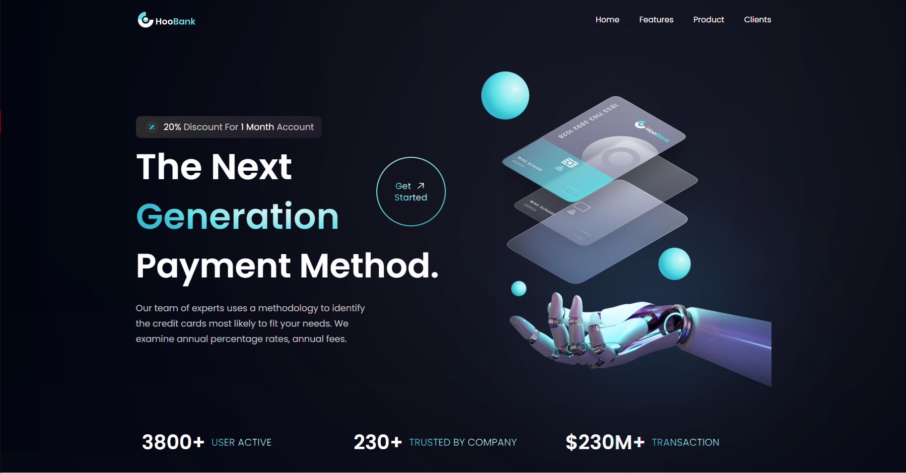

# Javascript-Mastery-HooBank
Desenvolvendo site responsivo utilizando React.js/Tailwind

Projeto desenvolvido pelo canal JavaScript Mastery
Link: https://www.youtube.com/watch?v=_oO4Qi5aVZs

Desenvolvi o projeto com o intuito de melhorar minhas habilidades em React.js & Tailwind. Acompanhei o tutorial inteiro oferecido pelo canal, e após a finalização do vídeo alterei algumas coisa do projeto original.
As modificações foram:
 - Mudança de cor;
 - Transições de botões;
 - Alteração no projeto figma;
 - Edição de imagens;
 
 <h2> Projeto Modificado </h2>
 
 
 <h2> Projeto Original </h2>
 
 
 
 
